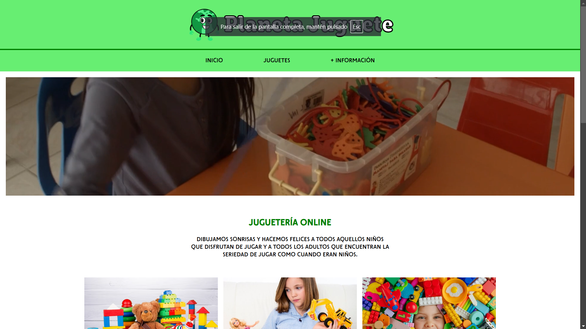
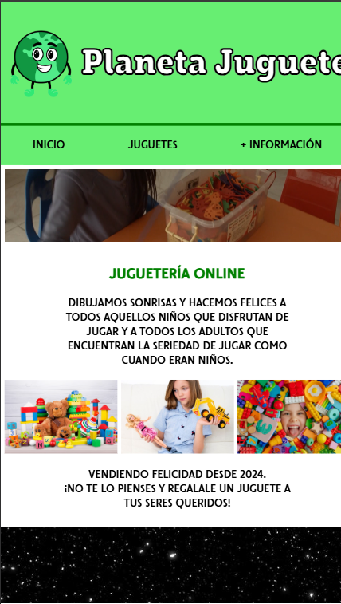
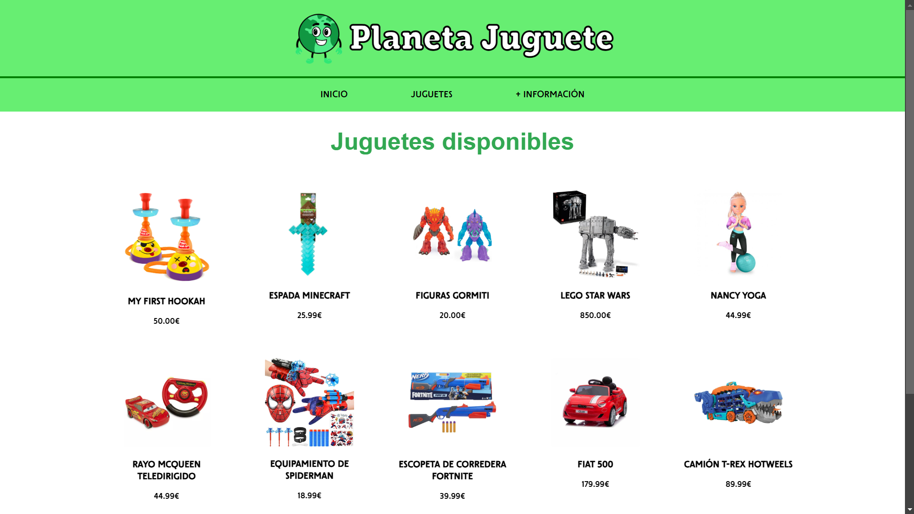
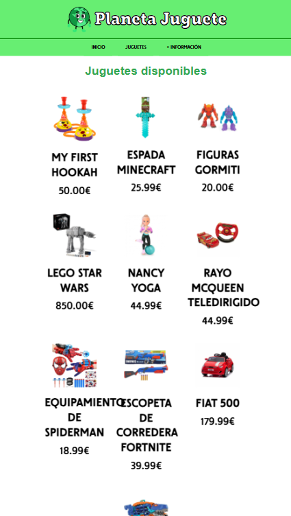
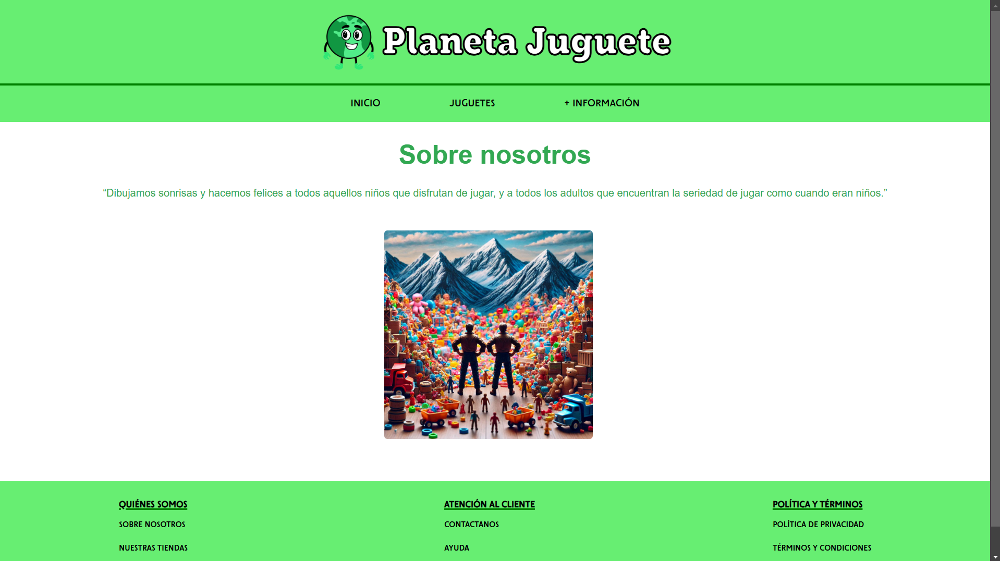
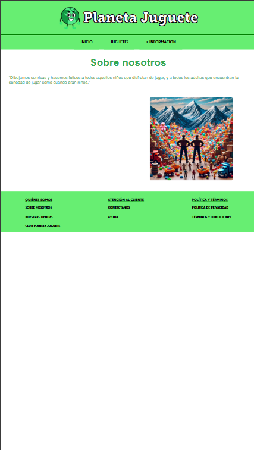
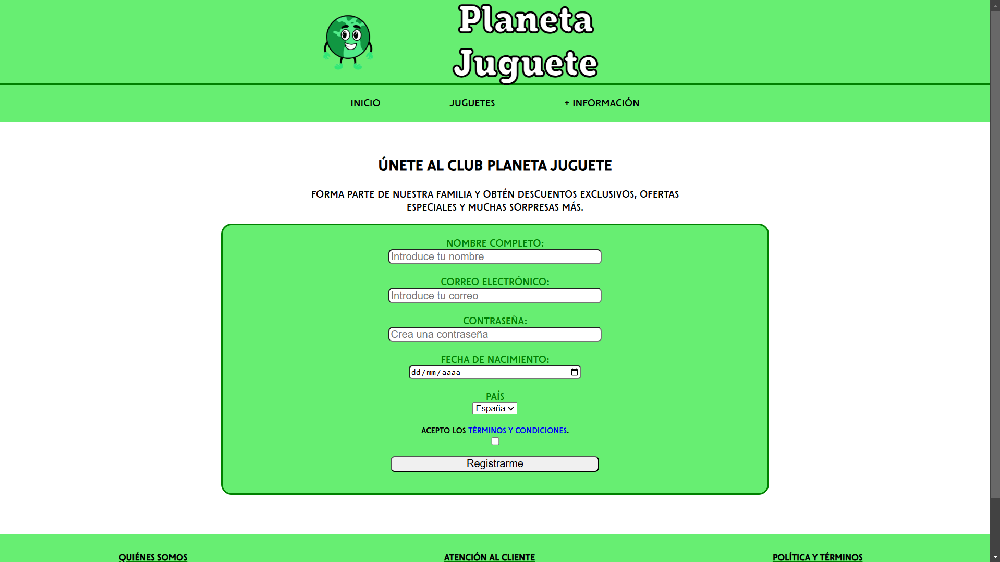
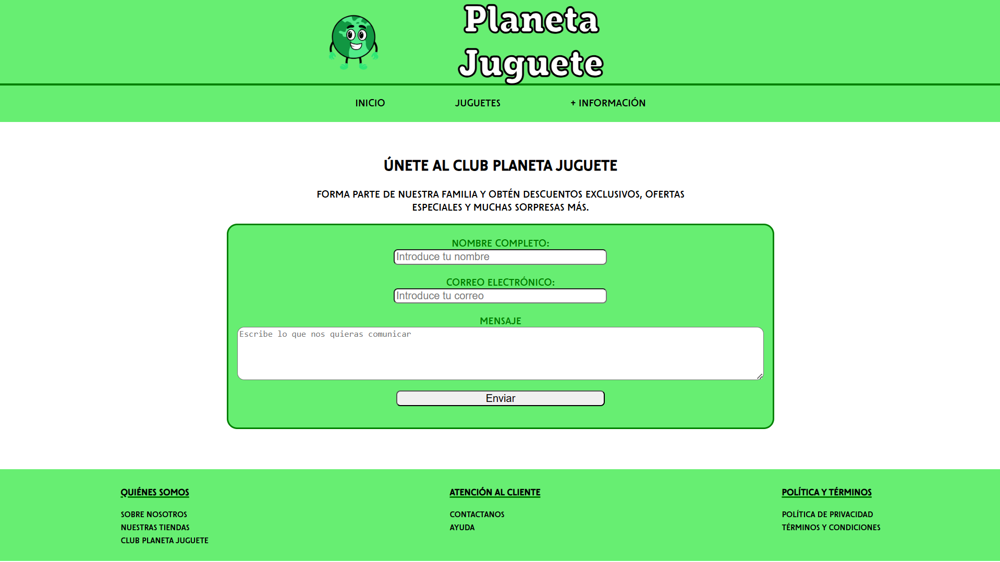

# Planeta Juguete

## Estructura

### Tecnologías:
- HTML5
- CSS
- Visual Studio Code con extensiones:
  - Live Preview
  - Plottier
- ChatGPT para la generación de imágenes y aclaraciones
- Google para la multimedia, fuentes y visualización de la página

### Características:
- **Colores principales**: #67ee72 y green.
- **Enlaces** que dirigen a las otras páginas de la web con hovers y actives.
- **Imagen parallax** en la página index.

### División de tareas
- **Juan**: index y formularios
- **Martí**: artículos e info

### Fotos
[]
[]
[]
[]
[]
[]

#### Formularios

[]

[]

### Expresiones regulares para la validación
